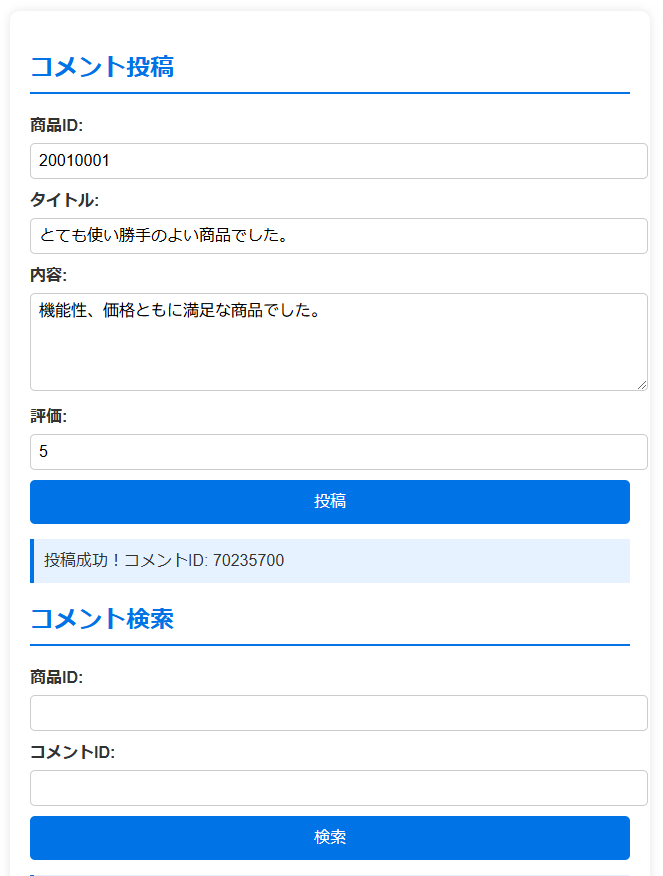

1. 環境設定（asdfをインストールしていることを前提にnodeをインストール）

```bash
$ make install-tools
```

2. ローカルのブラウザで表示

```bash
$ make up
```

3. [ブラウザ](http://localhost:8000/index.html)にアクセス<br>

http://localhost:8000/index.html

